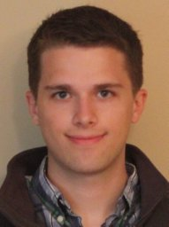
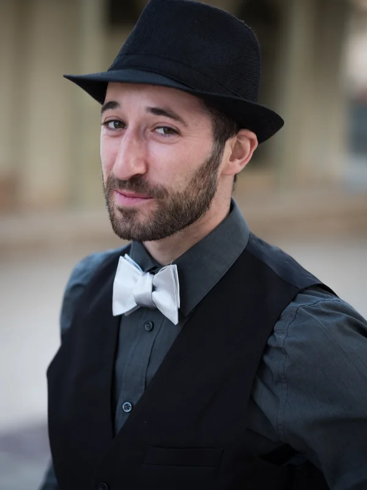

# Advisors
<!-- 
* [Kristjan Greenwald](https://kgreenewald.github.io/)
* [Mikhail Yurochkin](https://moonfolk.github.io/)
* [Mohit Bansal](https://www.cs.unc.edu/~mbansal/) 
* [Colin Raffel](https://colinraffel.com/)
* [Leshem Choshen](https://ktilana.wixsite.com/leshem-choshen) -->

<table cellspacing="0" cellpadding="0" style="border-collapse: collapse;">
    <tr>
        <td style="text-align: center; border: none;">
            

                
                <h4><a href="https://kgreenewald.github.io/">Kristjan Greenwald</a></h4>
                
 Research Staff Member, MIT-IBM Watson AI Lab, IBM Research

            

        </td>
        <td style="text-align: center; border: none;">
            

                
                <h4><a href="https://moonfolk.github.io/">Mikhail Yurochkin</a></h4>
                
Research Manager, MIT-IBM Watson AI Lab, IBM Research

            

        </td>
        <td style="text-align: center; border: none;">
            

                
                <h4><a href="https://www.cs.unc.edu/~mbansal/">Mohit Bansal</a></h4>
                
Parker Distinguished Professor, Director UNC-NLP Group, UNC Chapel Hill

            

        </td>
    </tr>
    <tr>
        <td style="text-align: center; border: none;">
            

                
                <h4><a href="https://colinraffel.com/">Colin Raffel</a></h4>
                
 Associate Professor, University of Toronto, Associate Research Director, Vector Institute

            

        </td>
        <td style="text-align: center; border: none;">
            

                
                <h4><a href="https://ktilana.wixsite.com/leshem-choshen">Leshem Choshen</a></h4>
                
 Research Scientist,  MIT-IBM Watson AI Lab, IBM Research, MIT

            

        </td>
        <td style="border: none;"></td>
    </tr>
</table>
